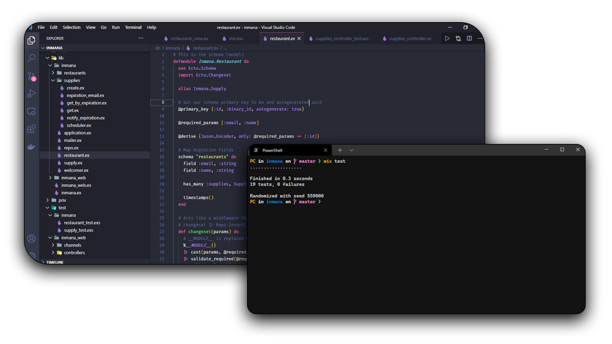

<h1 align="center">InMana</h1>

  |&nbsp;&nbsp;&nbsp;
  <a href="#-technologies">Techs</a>&nbsp;&nbsp;&nbsp;|&nbsp;&nbsp;&nbsp;
  <a href="#-project">Project</a>&nbsp;&nbsp;&nbsp;|&nbsp;&nbsp;&nbsp;
  <a href="#-build-&-run">Build & run</a>&nbsp;&nbsp;&nbsp;|&nbsp;&nbsp;&nbsp;
  <a href="#-more">More</a>&nbsp;&nbsp;&nbsp;|&nbsp;&nbsp;&nbsp;

  
  

## 👨‍💻 Technologies

This project was developed using the following technologies:

- [Docker](https://www.docker.com/)
- [PostgreSQL](https://postgresql.org)
- [Elixir](https://github.com/elixir-lang/elixir)
- [Phoenix](https://github.com/phoenixframework/phoenix)
- [Ecto](https://github.com/elixir-ecto/ecto)
- [ExUnit](https://github.com/elixir-lang/elixir/blob/master/lib/ex_unit/lib/ex_unit.ex)

## 💻 Project

Inmana is a RESTful API which simulates an inventory manager designed for restaurants. For every restaurant registered in the platform, Inmana will weekly send an e-mail warning about the products that will expire.

## 🚀 Build & Run

To start your Phoenix server:

  * Set everything up with `mix setup`
  * Start Phoenix endpoint with `mix phx.server`

Now you can visit [`localhost:4000`](http://localhost:4000) from your browser.

Ready to run in production? Please [check the deployment guides](https://hexdocs.pm/phoenix/deployment.html).

## 📚 More

  * Official website: https://www.phoenixframework.org/
  * Guides: https://hexdocs.pm/phoenix/overview.html
  * Docs: https://hexdocs.pm/phoenix
  * Forum: https://elixirforum.com/c/phoenix-forum
  * Source: https://github.com/phoenixframework/phoenix

---

Made with ♥ by [lucasig11](https://github.com/lucasig11) 👋🏻